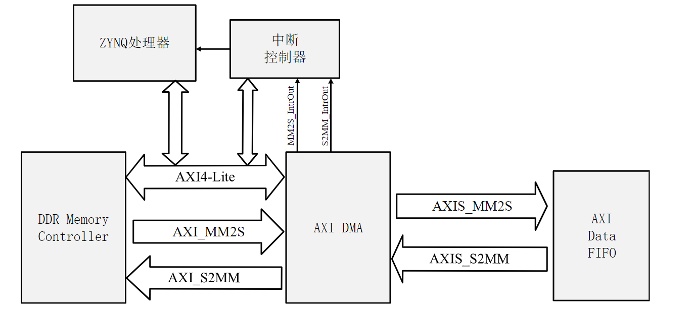
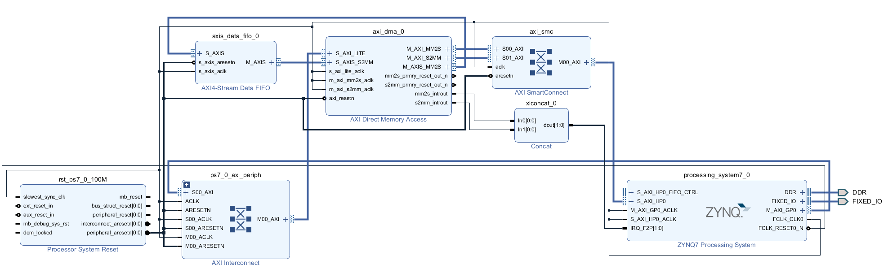

# 目前的状态

目前的与Xlinx官方给的样例相似，不同的是 PL 侧使用了一个 FIFO 核用来缓存写入数据，PS侧加入了串口和PC通信。整个系统在工作时，首先 PS 嵌入式cpu会通过 AXI4-Lite 对 DMA 核进行配置，随后串口数据被写入 DDR 中。AXI DMA 核会被控制去读取 DDR 中的数据，并将数据写入到位于 PL 侧的 FIFO 中，当完成了该步骤，会产生一个输出给中断控制器的中断。再然后，PS 控制 DMA 将 FIFO 中的数据读出，通过 AXI 总线再次写回到 DDR中。完成了该步骤后，DMA 会产生另一个中断给中断控制器。重新写回 DDR的数据会被拿来与最初读出的数据进行比较，判断数据是否一致

# 下一步
1 尝试对输入数据进行简单处理后输出验证通路有效性 
2 更改串口为其他更高速率接口
